# 05 · Reporte de defectos

| | |
|---|---|
| **Build** | commit `15765d9` (main de `biaenergy/prueba-qa`) |
| **Entorno principal** | Windows (x64) · Microsoft Edge (reproducción manual) y Chromium 141 de Playwright 1.56.1 (automatización) · zona horaria **America/Bogota (UTC-5)** · locale `es-CO` · backend Go 1.27.1 en :8080 (`go run ./cmd/api`, sin `OPENAI_API_KEY`) · frontend Vite 8 en :5173 (modo desarrollo) · Node 24.21 |
| **Entorno de apoyo** | Linux x86_64 · Chromium 141 · Go 1.26.6 · Node 22.22 (mismos resultados) |
| **Usuario** | `admin@energia.local` |
| **Evidencia** | [`evidencias/`](evidencias/). Cada captura tiene encabezado con el entorno, recuadros numerados sobre el elemento exacto y una leyenda *Esperado / Obtenido / Fuente* |

## Criterios

- **Severidad**: impacto en el negocio y en el usuario si el defecto llega a producción.
- **Prioridad**: urgencia de la corrección, según la exposición (cuántos usuarios lo ven, en qué pantalla) y el costo del arreglo.

Cuando son distintas, la ficha explica por qué.

| Severidad | Significado |
|---|---|
| Alta | El operador toma una decisión equivocada o no puede acceder a información crítica |
| Media | Información incorrecta o contradictoria, pero con alternativa o sin pérdida de datos |
| Baja | Inconsistencia con la documentación con poco impacto práctico |

## Resumen

| ID | Título | Severidad | Prioridad | Capa | Caso | Test que lo evidencia |
|---|---|---|---|---|---|---|
| [DEF-01](#def-01--la-hora-de-planta-se-muestra-5-h-antes-en-colombia) | La hora de planta se muestra 5 h antes en Colombia | **Alta** | **Alta** | Frontend | CN-19 | `e2e/tests/ui/timezone.spec.ts` · `format.tz.test.ts` |
| [DEF-02](#def-02--el-libro-de-medidores-no-deja-pasar-a-la-página-2) | El libro de medidores no deja pasar a la página 2 | **Alta** | **Alta** | Frontend | CN-08 | `e2e/tests/ui/defects.spec.ts` · `Pagination.test.tsx` |
| [DEF-03](#def-03--un-false_positive-m-106-tiene-estado-alert-en-vez-de-normal) | Un FALSE_POSITIVE (M-106) tiene estado ALERT | Media | **Alta** | Backend | CN-09, 13, 20 | `meter/defects_test.go` · `e2e/tests/api/meters.api.spec.ts` |
| [DEF-04](#def-04--la-búsqueda-por-meter_id-distingue-mayúsculas) | La búsqueda por `meter_id` distingue mayúsculas | Baja | Media | Backend | CN-10 | `meter/defects_test.go` · `e2e` API y UI |
| [DEF-05](#def-05--paginationpage-negativo-responde-500-en-vez-de-400) | `page` negativo responde 500 (panic) | Media | Media | Backend | CN-07 | `httpx/paging_defects_test.go` · `e2e` API |
| [DEF-06](#def-06--los-límites-de-severidad-no-coinciden-con-la-documentación) | Límites de severidad ≥ vs. "supera" (>) | Baja | Baja | Backend | — (caja blanca) | `classify/severity_defects_test.go` |
| [DEF-07](#def-07--después-del-login-no-siempre-vuelve-a-la-ruta-pedida) | Tras el login no siempre vuelve a la ruta pedida | Media | Media | Frontend | CN-22 | `e2e/tests/ui/defects.spec.ts` |
| [DEF-08](#def-08--una-hora-faltante-genera-data_quality-con-fecha-0001-01-01) | Una hora faltante genera DATA_QUALITY con fecha 0001-01-01 | Media | Baja | Backend | — (caja blanca) | `analysis/quality_defects_test.go` |

---

## DEF-01 · La hora de planta se muestra 5 h antes en Colombia

| Campo | Detalle |
|---|---|
| **Severidad** | **Alta.** Todas las horas de la UI salen corridas −5 h, y en 3 de las 4 anomalías también cambia el **día**. El operador iría a revisar en sitio con la hora equivocada. Además, la misma tarjeta se contradice: el texto del motor dice 14:00 y el encabezado dice 09:00 |
| **Prioridad** | **Alta.** Afecta al 100 % de los usuarios (todos en America/Bogota), está en la primera pantalla y el arreglo es de una línea |
| **Pantallas afectadas** | Despacho (tarjetas de orden) · Anomalías IA (columna "Detectada") · Detalle de medidor ("Última lectura", gráfica horaria, eventos) · Investigación ("Detectada", ventana del cambio) |
| **Precondición** | Navegador o sistema operativo en zona America/Bogota; sesión iniciada |
| **Fuente del esperado** | frontend/README.md: *"Las fechas del dataset son hora de planta: se muestran tal como vienen, sin convertirlas a la zona del navegador"* · PRODUCT.md: *"never convert them to the browser's time zone"* · API: `detected_at = 2026-09-12T14:00:00Z` · texto del motor: *"desde 12/09 14:00"* |

**Reproducción**

```gherkin
Escenario: DEF-01 · La hora "Detectada" de M-109 coincide con la del motor
  Dado que mi navegador está en la zona horaria "America/Bogota"
  Y que inicié sesión como "admin@energia.local"
  Cuando abro "Despacho"
  Y miro la tarjeta "Orden 1 de 4" del medidor M-109
  Entonces el encabezado dice "Detectada 12/09 14:00"
  Pero obtengo "Detectada 12/09 09:00", mientras el párrafo "Qué encontró la IA" dice "desde 12/09 14:00"
```

| Dónde mirar | Esperado | Obtenido |
|---|---|---|
| Despacho → tarjeta Orden 1 (M-109) → esquina superior derecha | Detectada 12/09 14:00 | **Detectada 12/09 09:00** |
| Anomalías IA → columna "Detectada" → M-112 | 13/09 00:00 | **12/09 19:00** |
| Anomalías IA → columna "Detectada" → M-104 | 11/09 00:00 | **10/09 19:00** |
| Anomalías IA → columna "Detectada" → M-106 | 08/09 00:00 | **07/09 19:00** |
| Detalle M-109 → encabezado → "Última lectura" | 14/09 23:00 | **14/09 18:00** |
| **Control:** Despacho con el navegador en UTC | 12/09 14:00 | 12/09 14:00 ✔ |

**Evidencia**

1. Despacho, tarjeta de M-109 en Bogotá: el recuadro 1 (rojo) es la hora incorrecta y el 2 (verde) la referencia del motor.
   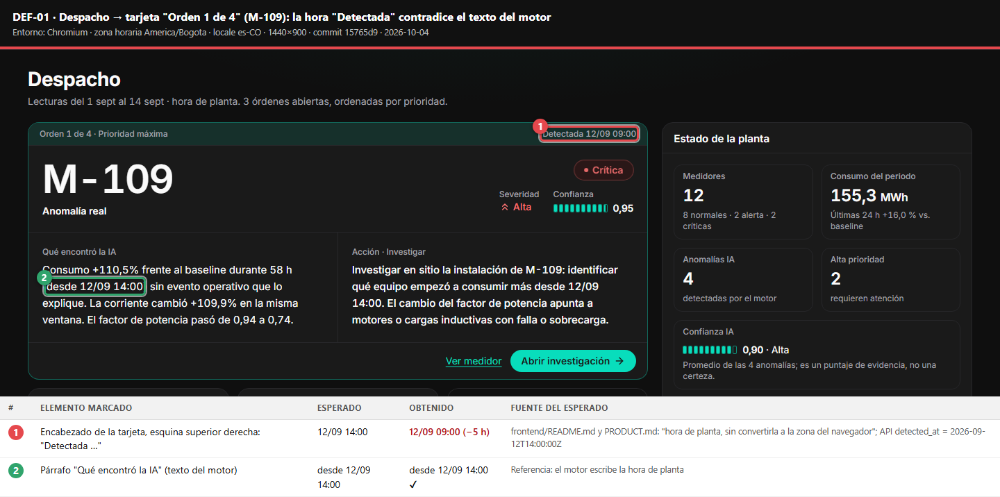
2. Control: la misma tarjeta en UTC, donde las dos horas coinciden. Prueba que el error depende de la zona del navegador.
   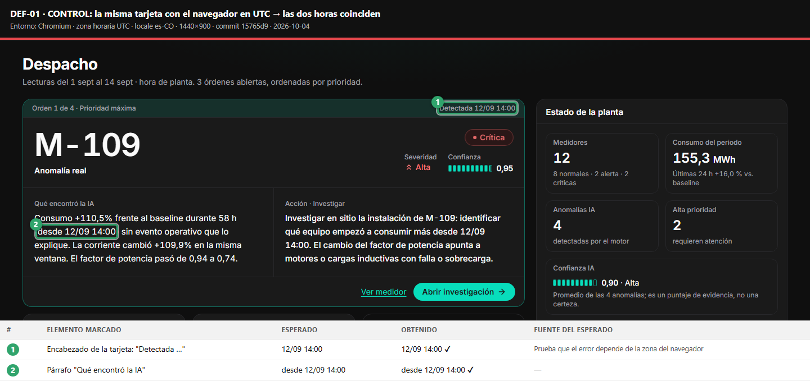
3. Anomalías IA, columna "Detectada": las 4 filas, con la tabla esperado vs. obtenido.
   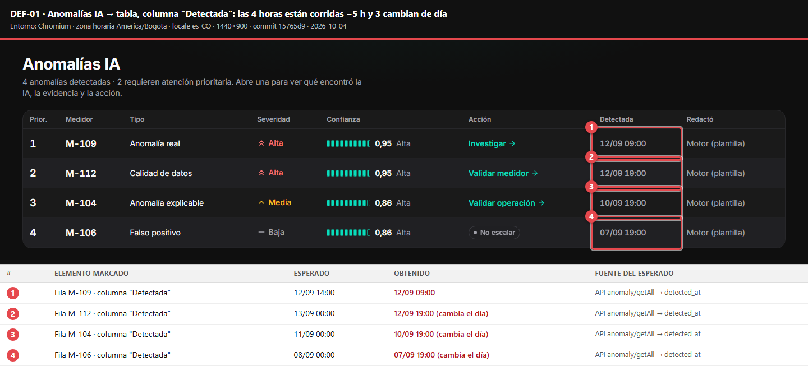
4. Detalle de M-109, "Última lectura".
   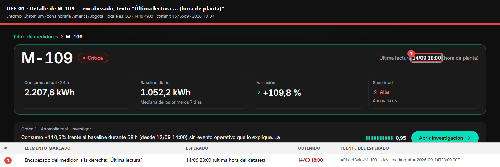
5. Reproducción manual en mi equipo (Windows + Microsoft Edge, zona horaria del sistema America/Bogota). Se ve el mismo defecto sin automatización; en la misma pantalla aparece DEF-03 (recuadro 3).
   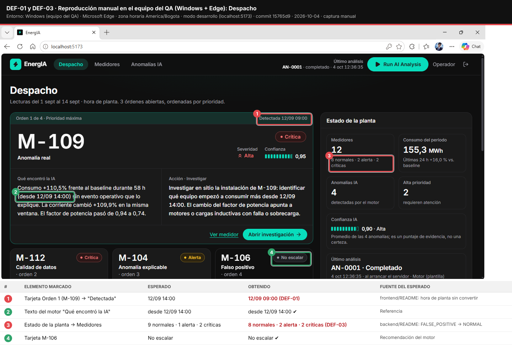

| Análisis | Detalle |
|---|---|
| **Causa raíz** | `frontend/src/lib/format.ts:57`. `formatPlantTime` usa `getDate()/getMonth()/getHours()/getMinutes()` (hora **local**) en vez de `getUTC*()`, aunque el comentario de las líneas 51–52 dice "se leen las partes UTC". Las funciones vecinas `formatPlantDate` y `formatPlantDay` sí usan `getUTC*` |
| **Por qué no lo detectaron** | `frontend/vite.config.ts:33` fuerza `TZ: 'UTC'` en los tests. En UTC, local = UTC, así que el test de formato pasa con cualquier implementación |
| **Arreglo sugerido** | Usar `getUTCDate()`, `getUTCMonth()`, `getUTCHours()` y `getUTCMinutes()` en `formatPlantTime` |
| **Detección automática** | `frontend/src/lib/format.tz.test.ts` (`vi.stubEnv('TZ','America/Bogota')`, `it.fails`) · `e2e/tests/ui/timezone.spec.ts`, que corre en `chromium-bogota` (falla, marcado `test.fail`) y en `chromium-utc` (pasa) |

---

## DEF-02 · El libro de medidores no deja pasar a la página 2

| Campo | Detalle |
|---|---|
| **Severidad** | **Alta.** M-111 y **M-112 (Crítica)** no se pueden alcanzar con los controles del libro en su orden por defecto. Un medidor crítico queda "invisible" en la pantalla de gestión |
| **Prioridad** | **Alta.** Es la navegación principal de la pantalla y el arreglo es trivial |
| **Por qué no es Crítica** | Hay alternativas: escribir `?pagina=2` en la URL, ordenar por severidad o filtrar por "Críticas" |
| **Pantalla** | Medidores (`/medidores`) → barra de paginación debajo de la tabla |
| **Precondición** | Sesión iniciada; sin filtros (12 medidores, 10 por página) |
| **Fuente del esperado** | frontend/README.md (lista paginada) · API: `count = 12`, `size = 10` → 2 páginas |

**Reproducción**

```gherkin
Escenario: DEF-02 · Pasar a la página 2 del libro
  Dado que inicié sesión
  Cuando abro "Medidores" sin filtros
  Entonces la paginación dice "1–10 de 12 medidores"
  Y el botón "Siguiente" está habilitado
  Pero obtengo el botón "Siguiente" deshabilitado
```

| Dónde mirar | Esperado | Obtenido |
|---|---|---|
| Barra de paginación, abajo a la izquierda | 1–10 de 12 medidores | 1–10 de 12 medidores ✔ |
| Botón "Siguiente", abajo a la derecha | Habilitado | **Deshabilitado** |
| URL `/medidores?pagina=2` (escrita a mano) | — | Muestra M-111 y M-112: la página existe |

**Evidencia**

1. El recuadro 1 (verde) es el total de 12 medidores y el 2 (rojo) el botón "Siguiente" deshabilitado.
   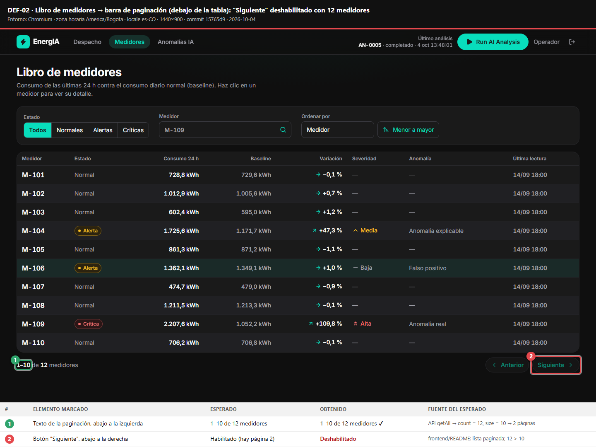
2. La página 2 sí existe, pero solo se llega por URL.
   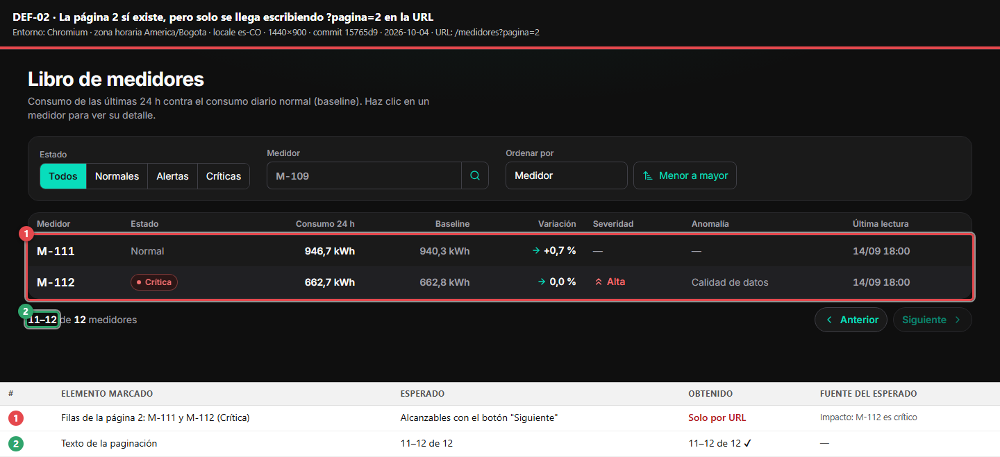

| Análisis | Detalle |
|---|---|
| **Causa raíz** | `frontend/src/features/meters/components/Pagination.tsx:13`: `const pages = Math.max(1, Math.floor(count / size))`. Con 12 / 10 da 1 página |
| **Arreglo sugerido** | `Math.ceil(count / size)` |
| **Valores límite** | count = 0, 9, 10 y 20 funcionan bien · **11 y 12 fallan** (cualquier count que no sea múltiplo de size) |
| **Detección automática** | `Pagination.test.tsx` (count 11 y 12, `it.fails`) · `e2e/tests/ui/defects.spec.ts` "DEF-02" (`test.fail`) |

---

## DEF-03 · Un FALSE_POSITIVE (M-106) tiene estado ALERT en vez de NORMAL

| Campo | Detalle |
|---|---|
| **Severidad** | **Media.** M-106 aparece con el sello "Alerta", el filtro "Alertas" lo incluye y el KPI cuenta 2 alertas. El sistema contradice su propia recomendación ("No escalar") y genera ruido. No se pierde información |
| **Prioridad** | **Alta.** Es una regla de negocio documentada de forma explícita, se ve en la primera pantalla (KPI) y el arreglo es de una línea |
| **Por qué difieren** | El impacto técnico es moderado, pero rompe la confianza del operador en la herramienta justo en el caso que el producto promete resolver |
| **Pantallas / endpoints** | Medidores → pestaña "Alertas" · Despacho → panel "Estado de la planta" · `GET /meter/getById/M-106` · `GET /dashboard/getSummary` · `POST /meter/getAll` con `status` |
| **Fuente del esperado** | backend/README.md, tabla "Estado de alerta": *"Sin anomalía, o `FALSE_POSITIVE` → `NORMAL`"* |

**Reproducción**

```gherkin
Escenario: DEF-03 · Un falso positivo tiene estado NORMAL
  Dado que tengo un token válido
  Cuando consulto GET "/api/v1/meter/getById/M-106"
  Entonces "anomaly_type" es "FALSE_POSITIVE"
  Y "status" es "NORMAL"
  Pero obtengo "status" = "ALERT"
  Y el dashboard cuenta {"normal": 8, "alert": 2, "critical": 2} en vez de {"normal": 9, "alert": 1, "critical": 2}
```

| Dónde mirar | Esperado | Obtenido |
|---|---|---|
| API `getById/M-106` → `status` | NORMAL | **ALERT** |
| Medidores → pestaña "Alertas" | Solo M-104 | **M-104 y M-106** |
| Despacho → "Estado de la planta" → "Medidores" | 9 normales · 1 alerta · 2 críticas | **8 normales · 2 alerta · 2 críticas** |

**Evidencia**

1. Pestaña "Alertas": el recuadro 2 marca el estado de M-106 y el 3 su tipo (falso positivo).
   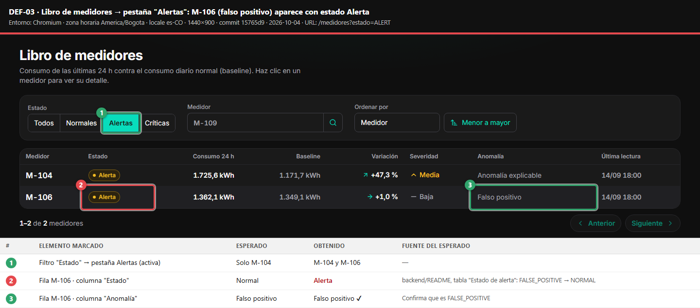
2. Despacho: la tarjeta dice "No escalar" (1), pero el KPI la cuenta como alerta (2).
   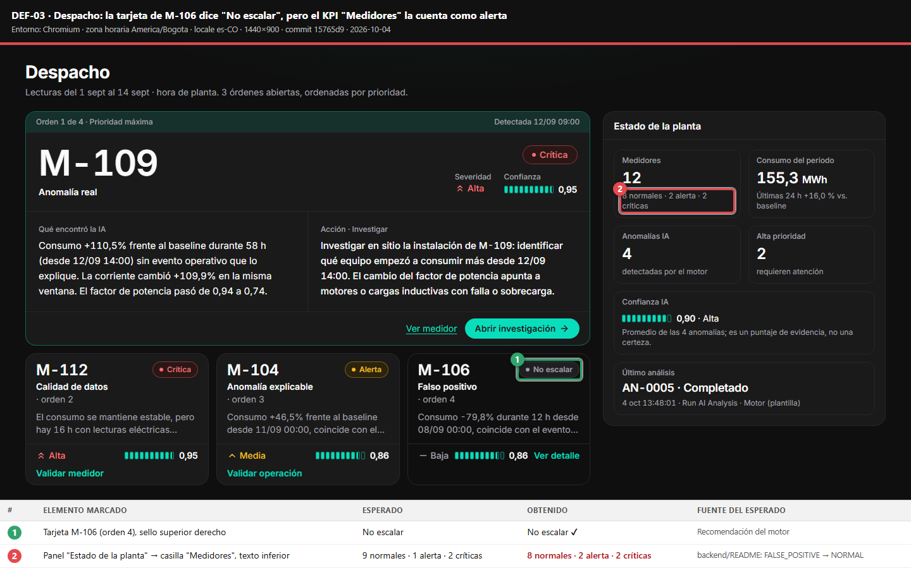
3. API: request y response.
   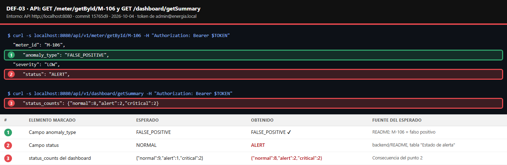
4. Reproducción manual en Windows + Edge: el recuadro 3 de [`DEF-01/05-despacho-edge-windows-manual.png`](evidencias/DEF-01/05-despacho-edge-windows-manual.png) muestra el KPI "8 normales · 2 alerta".

| Análisis | Detalle |
|---|---|
| **Causa raíz** | `backend/internal/meter/enums.go:29-38`: `StatusOf` solo evalúa `nil` y la severidad HIGH. No hay una rama para `model.TypeFalsePositive`, así que cae en `default → StatusAlert` |
| **Por qué no lo detectaron** | `TestStatusOf` prueba severidades, nunca el tipo FALSE_POSITIVE |
| **Arreglo sugerido** | `case a == nil \|\| a.Type == model.TypeFalsePositive: return StatusNormal` |
| **Detección automática** | `meter/defects_test.go` (tabla de decisión tipo × severidad, tag `defects`) · `e2e/tests/api/meters.api.spec.ts` (TD-2 por medidor y KPI) · `e2e/tests/ui/defects.spec.ts` |

---

## DEF-04 · La búsqueda por `meter_id` distingue mayúsculas

| Campo | Detalle |
|---|---|
| **Severidad** | **Baja.** El operador escribe "m-109" y ve "Ningún medidor coincide". Confunde, pero se resuelve escribiendo en mayúsculas o eligiendo una sugerencia |
| **Prioridad** | **Media.** Contradice un contrato documentado de la API y el arreglo es trivial |
| **Pantalla / endpoint** | Medidores → buscador "Medidor" · `POST /meter/getAll` con `filter.meter_id` |
| **Fuente del esperado** | backend/README.md: *"Búsqueda parcial, sin importar mayúsculas"* · Swagger · comentario de `Filter.MeterID` |

**Reproducción**

```gherkin
Escenario: DEF-04 · Buscar en minúsculas encuentra el medidor
  Dado que inicié sesión y estoy en "Medidores"
  Cuando escribo "m-109" en el buscador "Medidor"
  Y presiono "Buscar medidor"
  Entonces veo una fila: M-109
  Pero obtengo "Ningún medidor coincide con los filtros"
```

| Dónde mirar | Esperado | Obtenido |
|---|---|---|
| UI → resultado de buscar `m-109` | M-109 | **"Ningún medidor coincide con los filtros"** |
| API `getAll` con `meter_id: "m-109"` | count 1 | **count 0** |
| API `getAll` con `meter_id: "M-109"` (control) | count 1 | count 1 ✔ |
| API `getById/m-109` (control) | 200 | 200 ✔. Inconsistente con `getAll` |

**Evidencia**

1. UI: el recuadro 1 es el texto buscado y el 2 el resultado vacío.
   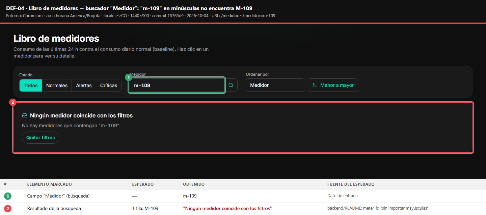
2. API: mayúsculas vs. minúsculas, y el control con `getById`.
   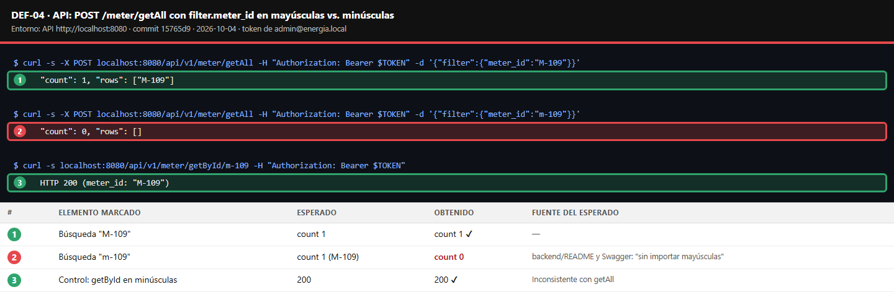

| Análisis | Detalle |
|---|---|
| **Causa raíz** | `backend/internal/meter/service.go:59` usa `strings.Contains(sm.MeterID, search)` sin normalizar. `dto.go:44` solo aplica `TrimSpace` |
| **Arreglo sugerido** | Comparar en mayúsculas: `strings.Contains(strings.ToUpper(sm.MeterID), strings.ToUpper(search))` |
| **Detección automática** | `meter/defects_test.go::TestQA_SearchIsCaseInsensitive` · `meters.api.spec.ts` y `defects.spec.ts` "DEF-04" |

---

## DEF-05 · `pagination.page` negativo responde 500 en vez de 400

| Campo | Detalle |
|---|---|
| **Severidad** | **Media.** Una entrada inválida produce un error interno con panic en el log. El servidor no se cae (el middleware `Recover` lo captura), pero se rompe el contrato de errores |
| **Prioridad** | **Media.** La UI no lo dispara (sanea `pagina` < 1), pero cualquier cliente de la API sí |
| **Endpoint** | `POST /api/v1/meter/getAll` |
| **Fuente del esperado** | Swagger: `page` con `minimum: 1` · formato de errores del backend/README · comportamiento simétrico de `size` (−1 → 400) |

**Reproducción**

```gherkin
Escenario: DEF-05 · page negativo es un error de validación
  Dado que tengo un token válido
  Cuando envío POST "/api/v1/meter/getAll" con {"pagination": {"page": -1, "size": 10}}
  Entonces la respuesta tiene código 400 con un error de validación de "pagination.page"
  Pero obtengo 500 "Error interno del servidor"
  Y el log del backend registra "panic: slice bounds out of range [:-10]"
```

```bash
curl -s -i -X POST localhost:8080/api/v1/meter/getAll \
  -H "Authorization: Bearer $TOKEN" -d '{"pagination":{"page":-1,"size":10}}'
```

| Dónde mirar | Esperado | Obtenido |
|---|---|---|
| Código HTTP | 400 | **500** |
| Log del backend | Sin errores | **`ERROR panic error="runtime error: slice bounds out of range [:-10]"`** |
| Control: `size: 101` | 400 | 400 ✔ |

**Evidencia:** request, response, log y control.
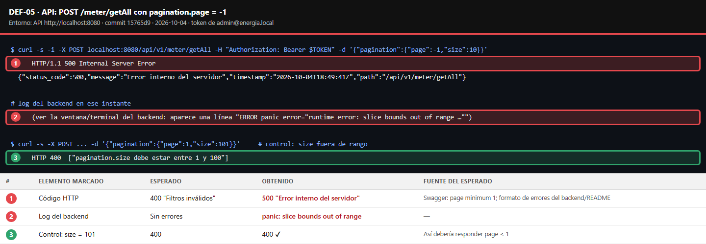

| Análisis | Detalle |
|---|---|
| **Causa raíz** | `backend/internal/httpx/paging.go:23-36`: `Normalize` valida `Size`, pero de `Page` solo reemplaza el 0. Después, en `:48`, `start := min((p.Page-1)*p.Size, len(items))` queda negativo y `items[start:end]` (`:54`) hace panic |
| **Arreglo sugerido** | En `Normalize`: `if p.Page < 1 { errs = append(errs, "pagination.page debe ser mayor o igual a 1") }` |
| **Detección automática** | `httpx/paging_defects_test.go` · `meter/defects_test.go::TestQA_NegativePageIsValidationError` · `meters.api.spec.ts` "DEF-05" |

---

## DEF-06 · Los límites de severidad no coinciden con la documentación

| Campo | Detalle |
|---|---|
| **Severidad** | **Baja.** Solo afecta valores exactamente en el límite (50,0 % o 20,0 %): el caso queda una severidad por encima. Para un 50,0 % activo eso significa CRITICAL en vez de ALERT |
| **Prioridad** | **Baja.** El dataset actual no lo dispara. Hay que decidir si se corrige el código o la documentación |
| **Cómo se encontró** | Caja blanca (no es observable con el dataset) |
| **Fuente del esperado** | backend/README.md §8: *"HIGH si la variación **supera** 50 % y sigue activa; MEDIUM si **supera** 20 %"* |

**Reproducción**

```gherkin
Esquema del escenario: DEF-06 · Severidad de REAL_ANOMALY en los valores límite
  Dado un cambio sostenido sin evento que lo explique, con variación de <variación> y activo = <activo>
  Cuando el motor calcula la severidad
  Entonces la severidad es "<esperado>"

  Ejemplos:
    | variación | activo | esperado | obtenido hoy |
    | 50.01 %   | sí     | HIGH     | HIGH ✔       |
    | 50 %      | sí     | MEDIUM   | HIGH ✘       |
    | -50 %     | sí     | MEDIUM   | HIGH ✘       |
    | 20.01 %   | no     | MEDIUM   | MEDIUM ✔     |
    | 20 %      | no     | LOW      | MEDIUM ✘     |
    | 19.99 %   | sí     | LOW      | LOW ✔        |
```

**Evidencia:** salida del test unitario.
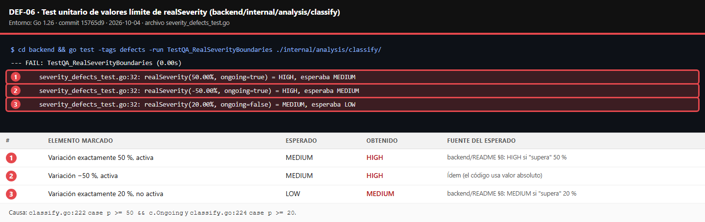

| Análisis | Detalle |
|---|---|
| **Causa raíz** | `backend/internal/analysis/classify/classify.go:222` `case p >= 50 && c.Ongoing` y `:224` `case p >= 20` usan `>=`, mientras la documentación dice "supera" (`>`). Además, `math.Abs` hace que las caídas también cuenten, algo que la documentación no menciona |
| **Detección automática** | `classify/severity_defects_test.go` (tag `defects`) |

---

## DEF-07 · Después del login no siempre vuelve a la ruta pedida

| Campo | Detalle |
|---|---|
| **Severidad** | **Media.** Un enlace compartido (`/medidores/M-104`, `/medidores?estado=CRITICAL`) se pierde al iniciar sesión y el usuario cae en el Despacho. El producto promete que los filtros "viven en la URL: se pueden compartir" |
| **Prioridad** | **Media.** Es frecuente y molesto, pero no bloquea: el usuario puede volver a abrir el enlace |
| **Frecuencia** | **Intermitente, ~70 %.** En 3 corridas en contextos limpios terminaron en `/`: 12 de 21, 8 de 10 y 9 de 10 intentos (29 de 41) |
| **Fuente del esperado** | `RequireAuth` guarda `from` para volver a esa ruta · frontend/README.md (filtros en la URL, compartibles) |

**Reproducción**

```gherkin
Escenario: DEF-07 · Volver al enlace original después del login
  Dado que no tengo una sesión iniciada
  Cuando abro "/medidores/M-104"
  Entonces me redirige a "/login"
  Cuando inicio sesión con "admin@energia.local" y "admin123"
  Entonces llego a "/medidores/M-104"
  Pero en la mayoría de los intentos llego a "/" (Despacho)
```

**Evidencia:** pantalla final después de "Entrar". La nota inferior muestra los 10 intentos y sus destinos.
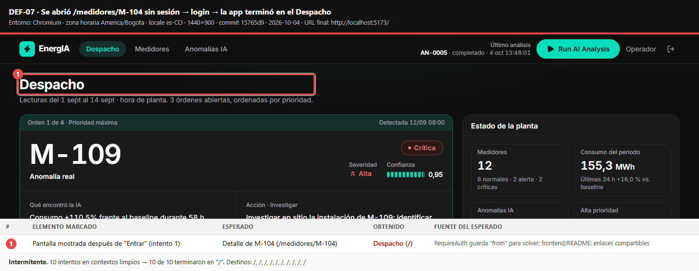

| Análisis | Detalle |
|---|---|
| **Causa raíz** | Hay una condición de carrera entre `frontend/src/app/routes/LoginRoute.tsx:13`, que redirige con `<Navigate to={paths.dashboard}>` apenas el estado pasa a `authenticated` (sin mirar `location.state.from`), y `features/auth/components/useLoginForm.ts:31`, que hace `navigate(from)` después del `await`. Gana la que llega primero |
| **Arreglo sugerido** | En `LoginRoute`: `<Navigate to={location.state?.from ?? paths.dashboard} replace />` |
| **Detección automática** | `e2e/tests/ui/defects.spec.ts` "DEF-07": repite el flujo 10 veces y exige el 100 % (`test.fail`; la probabilidad de un falso "pasa" es < 0,1 %) |

---

## DEF-08 · Una hora faltante genera DATA_QUALITY con fecha 0001-01-01

| Campo | Detalle |
|---|---|
| **Severidad** | **Media.** Si falta una sola lectura (muy común en medidores reales), el medidor se marca como problema de datos con fecha 01/01/0001 y el texto "Hay **0 h** con lecturas eléctricas incoherentes desde 01/01 00:00". La explicación y la evidencia quedan sin sentido |
| **Prioridad** | **Baja hoy.** El dataset no tiene huecos. Sube a Alta antes de conectar datos reales |
| **Cómo se encontró** | Caja blanca (latente, no observable con el dataset) |
| **Fuente del esperado** | backend/README.md §4: *"Con 3 horas sospechosas o más, el medidor tiene un problema de calidad de datos"* |

**Reproducción**

```gherkin
Escenario: DEF-08 · Un medidor sano con una hora faltante
  Dado un medidor con 335 lecturas horarias sanas y una hora faltante en la segunda semana
  Cuando el motor analiza el medidor
  Entonces el medidor queda normal, o la anomalía usa la fecha del hueco
  Pero obtengo DATA_QUALITY con detected_at = 0001-01-01T00:00:00Z
```

**Evidencia:** salida del test unitario.
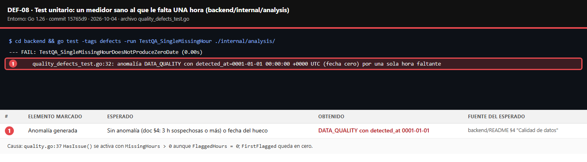

| Análisis | Detalle |
|---|---|
| **Causa raíz** | `backend/internal/analysis/quality/quality.go:37`: `HasIssue()` devuelve true con `MissingHours > 0` aunque `FlaggedHours = 0`. `FirstFlagged` y `LastFlagged` solo se llenan con horas sospechosas, así que quedan en cero |
| **Arreglo sugerido** | Registrar la fecha del hueco en `FirstFlagged`, o exigir `FlaggedHours >= 3` según la documentación |
| **Detección automática** | `analysis/quality_defects_test.go` (tag `defects`) |

---

## Hallazgos de entorno (no son del producto)

| Campo | Detalle |
|---|---|
| **ID** | E-01 |
| **Título** | El backend exige Go 1.26 y, sin él, `go run` intenta descargar el toolchain |
| **Impacto** | En redes con proxy o sin acceso a `proxy.golang.org`, `go run ./cmd/api` falla con 403 y la app no arranca en modo desarrollo |
| **Sugerencia** | Decir "Go 1.26+ **obligatorio**" en el README |

| Campo | Detalle |
|---|---|
| **ID** | E-02 |
| **Título** | Docker Desktop no arranca en el equipo del QA: *"Virtualization support not detected"* |
| **Causa** | La virtualización por hardware (VT-x/AMD-V) está desactivada en la BIOS del equipo. No es un defecto del producto |
| **Decisión** | Usar el modo desarrollo del README (`go run` + `pnpm dev`), que ejecuta el mismo código. El `docker-compose.yml` no se validó |
| **Sugerencia** | Mencionar en los requisitos del README que Docker Desktop necesita la virtualización activa |
| **Evidencia** | [`evidencias/entorno/E-02-docker-sin-virtualizacion.png`](evidencias/entorno/E-02-docker-sin-virtualizacion.png) |
